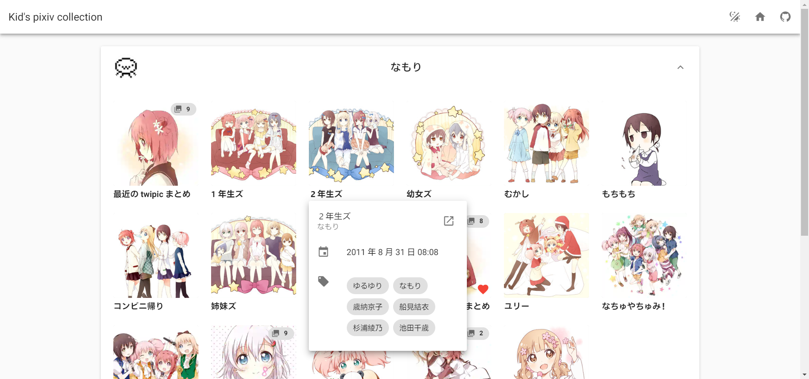
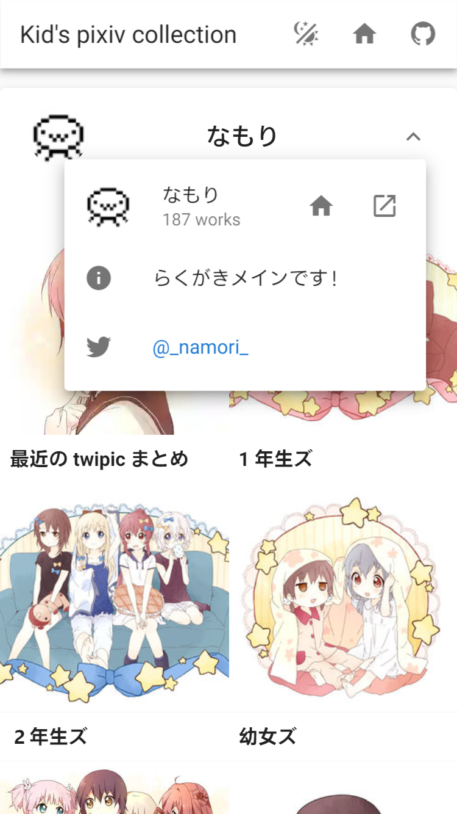

<h1 align="center">pixiv Collection</h1>

<div align="center">

[](https://pixiv.now.sh/)
[](./LICENSE)

[English](README.md) | 简体中文

</div>

简洁的 pixiv 收藏展示台。

Desktop | Mobile
---         | ---
 | 

## 特点

- Material Design 2
- 可放大的相册视图
- 高度可定制的收藏夹
- 自动按画师分类
- 插画和画师信息一览
- 图片懒加载
- 大量其他优化

## 使用方法

1. API 是为 [Now](https://zeit.co/now) 开发的，如果你没有 ZEIT 帐号，免费[注册](https://zeit.co/signup)一个。
2. Fork 或 clone 本仓库并设置你的[偏好和收藏](./config.js)：

```js
export default {
  // ...
  collection: [
    // 插画 ID
    20959870,
    {
      // 或者链接
      id:
        'https://www.pixiv.net/member_illust.php?mode=medium&illust_id=20959870',
      // 红心 ❤️
      favorite: true,
      // 按页码选择
      pages: [1, 11],
      // 排除选择项
      exclude: true,
      // 封面
      cover: 7
    }
  ]
}
```

3. 同时设置[页面标题](./public/index.html#L5)和 [Now alias](./now.json#L25) (可选)。
4. 部署至 Now 然后查看你的精美收藏吧！

## 开发

- 安装依赖 `yarn` & `yarn add now --dev`
- 运行 `yarn serve`
- 构建 `yarn build`

## 鸣谢

以下项目使 pixiv Collection 成为了可能：

- [pixiv API](https://api.imjad.cn/pixiv_v2.md)
- [pixiv 图片代理](https://pixiv.cat/reverseproxy.html)
